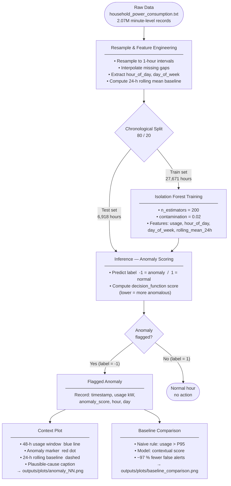

# Prototype Flow Diagram — AI-Based Energy Anomaly Detector

> **Export instructions:** paste the fenced block above into [mermaid.live](https://mermaid.live) and use *Download PNG* or *Download SVG* to get the image for your slide deck / report.
